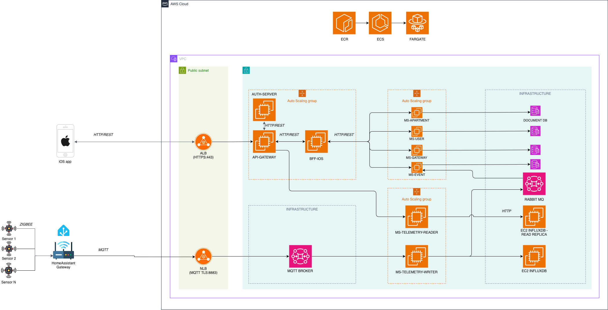

# Home IoT Platform


## Overview

**Home IoT** is a comprehensive, open-source Internet of Things platform designed for intelligent home automation and telemetry management. Built on a cloud-native microservices architecture, it enables real-time collection, processing, and analysis of sensor data from Zigbee-enabled IoT devices.

The platform supports seamless integration with smart home devices, asynchronous event processing, centralized user management, and a secure, scalable API layer — ready for local development via Docker Compose and production deployment on AWS Fargate.

---

## Technology Stack

| Layer | Technology |
|-------|-----------|
| **Language** | Java 21 |
| **Framework** | Spring Boot 4.0.1, Spring Cloud 2025.1.0 |
| **Build** | Gradle (Kotlin DSL), shared version catalog (`gradle/libs.versions.toml`) |
| **API Gateway** | Spring Cloud Gateway (WebFlux) with JWT authentication filter |
| **Message Broker** | RabbitMQ (AMQP 0.9.1) |
| **IoT Protocol** | MQTT v3.1.1 (Eclipse Paho + Spring Integration MQTT) |
| **Databases** | MongoDB 7 (domain data), InfluxDB 2 (time-series telemetry) |
| **Security** | Spring Security, JWT (jjwt 0.12.7), RBAC |
| **Resilience** | Resilience4j (circuit breaker + retry) |
| **Mapping** | MapStruct 1.6.3 |
| **API Docs** | Springdoc OpenAPI 3 + Swagger UI |
| **IoT Forwarder** | Python 3.11 + paho-mqtt |
| **Containerization** | Docker multi-stage builds, Docker Compose |
| **Cloud Ready** | AWS Fargate, ALB, DocumentDB, Amazon MQ, InfluxDB on EC2 |

---

## Architecture



### Data Flow

```
Zigbee Device → Zigbee2MQTT → Mosquitto (local MQTT broker)
                                    ↓
                        zigbee2mqtt-forwarder (Python)
                                    ↓
                        Mosquitto / AWS IoT Core (remote MQTT broker)
                                    ↓
                          ms-telemetry-writer
                            ├─→ InfluxDB  (time-series storage)
                            └─→ RabbitMQ  (telemetry events)
                                    ↓
                              ms-events (consumer)
                                ├─→ MongoDB (event persistence)
                                └─→ Threshold evaluation (alarms)
                                    ↓
            Client App ←→ ALB ←→ api-gateway ←→ bff-ios / ms-* services
```

---

## Microservices Map

| # | Service | Type | Port | Infrastructure | Description |
|---|---------|------|------|----------------|-------------|
| 1 | **api-gateway** | API Gateway (WebFlux) | 8080 | — | Single entry point. JWT auth, RBAC, path rewriting, routing to all downstream services |
| 2 | **auth-server** | Auth + JWT | 8080 | — | Issues and validates JWT tokens. Delegates credential check to ms-user |
| 3 | **bff-ios** | BFF (Reactive) | 8080 | — | Backend-for-Frontend for the iOS app. Aggregates data from multiple services with Resilience4j circuit breakers |
| 4 | **ms-apartment** | Domain CRUD | 8080 | MongoDB | Apartments, rooms, device mappings |
| 5 | **ms-gateway** | Domain CRUD | 8080 | MongoDB | IoT gateways and device metadata |
| 6 | **ms-user** | Domain CRUD | 8080 | MongoDB | User accounts, roles, credentials |
| 7 | **ms-events** | Event Processor | 8080 | MongoDB, RabbitMQ | Consumes telemetry events, evaluates thresholds, generates alarms |
| 8 | **ms-telemetry-reader** | Telemetry Query (WebMVC) | 8080 | InfluxDB | REST API for historical telemetry queries (Flux language) |
| 9 | **ms-telemetry-writer** | Telemetry Ingest (headless) | — *(actuator: 8082)* | InfluxDB, RabbitMQ, MQTT | Subscribes to MQTT topics, writes to InfluxDB, publishes events to RabbitMQ |
| 10 | **zigbee2mqtt-forwarder** | MQTT Bridge (Python) | — | MQTT | Bridges local Zigbee2MQTT broker to remote MQTT broker |
| — | **home-iot-common** | Shared Library | N/A | — | DTOs, security configs, CORS, Jackson, exception handling. Used by all JVM services |

---

## Shared Library — `home-iot-common`

A plain JAR (no Spring Boot app) included as a Gradle project dependency by every JVM microservice:

```kotlin
implementation(project(":home-iot-common"))
```

Provides:
- **DTOs** — `ApartmentDto`, `GatewayDto`, `EventDto`, `TelemetryEventDto`, `JwtValidationResultDto`, etc.
- **Security configs** — `MvcSecurityConfig` (Servlet) and `ReactiveSecurityConfig` (WebFlux), auto-selected via `@ConditionalOnWebApplication`
- **Cross-cutting** — CORS config, Jackson config, `RequestIdFilter`, `RestTemplate`/`WebClient` builders, global exception handler
- **Constants** — `ApplicationConstants.USER_ID_HEADER` (`X-User-Id`)

---

## Communication Patterns

### Synchronous (REST)
All inter-service calls use direct HTTP via **URL diretti** configured with environment variables — no Eureka, no service registry.

```yaml
# Example: api-gateway routes
uri: http://${MS_APARTMENT_HOST:localhost}:${SERVICES_PORT:8080}
```

### Asynchronous (RabbitMQ)
- **Producer**: `ms-telemetry-writer` publishes `TelemetryEventDto` to a `DirectExchange` (`telemetry.exchange`) with routing key `telemetry.key`
- **Consumer**: `ms-events` listens on `telemetry.queue` with **manual ACK** and processes threshold-based alarm logic

### IoT (MQTT)
- `ms-telemetry-writer` subscribes to `gateways/+/sensors/#` via Spring Integration MQTT (Eclipse Paho)
- `zigbee2mqtt-forwarder` bridges local Zigbee2MQTT topics to the remote broker

---

## Configuration Profiles

Every service ships three Spring profiles:

| Profile | Activated via | Purpose |
|---------|--------------|---------|
| `default` | — | Local IDE development (`localhost`) |
| `docker` | `SPRING_PROFILES_ACTIVE=docker` | Docker Compose (container DNS names) |
| `aws` | `SPRING_PROFILES_ACTIVE=aws` | AWS Fargate (DocumentDB TLS, Amazon MQ TLS, JSON logging) |

### Key Environment Variables

| Variable | Services | Purpose |
|----------|----------|---------|
| `HOME_IOT_JWT_SECRET` | auth-server | JWT signing key |
| `HOME_IOT_ADMIN_USERNAME` / `PASSWORD` | ms-user | Bootstrap admin account |
| `HOME_IOT_INFLUX_HOST` / `API_TOKEN` | telemetry-reader, telemetry-writer | InfluxDB connection |
| `HOME_IOT_MQTT_HOST` / `CLIENT_ID` / `TOPIC` | telemetry-writer | MQTT broker connection |
| `SPRING_RABBITMQ_HOST` / `PORT` | ms-events, telemetry-writer | RabbitMQ connection |
| `SPRING_DATA_MONGODB_HOST` / `DATABASE` | ms-apartment, ms-gateway, ms-user, ms-events | MongoDB connection |
| `MONGODB_URI` | *(aws profile only)* | Full DocumentDB URI with TLS |
| `MS_*_HOST`, `SERVICES_PORT` | api-gateway, auth-server, bff-ios, ms-events | Inter-service URL resolution |

---

## Getting Started

### Prerequisites

- **Java 21**
- **Docker & Docker Compose**
- **Git**

### 1. Clone with submodules

```bash
git clone --recursive https://github.com/davidedilecce/home-iot.git
cd home-iot
```

### 2. Set environment variables

```bash
cp .env.example .env
# Edit .env with your values (JWT secret, admin credentials, InfluxDB token, etc.)
```

### 3. Start everything

```bash
# Full stack (infra + all 9 services)
docker compose up -d --build

# Watch logs
docker compose logs -f

# Stop
docker compose down

# Stop and delete volumes
docker compose down -v
```

### 4. Fast development (IDE mode)

```bash
# Start only infrastructure
docker compose up -d mongodb rabbitmq influxdb mosquitto

# Run individual services from your IDE with Spring profile "docker"
# VM option: -Dspring.profiles.active=docker
```

### Port Map (Docker Compose)

| Service | Host Port | Container Port |
|---------|-----------|---------------|
| **api-gateway** (entry point) | `localhost:8080` | 8080 |
| auth-server | `localhost:8889` | 8080 |
| bff-ios | `localhost:8010` | 8080 |
| ms-apartment | `localhost:9000` | 8080 |
| ms-gateway | `localhost:9001` | 8080 |
| ms-user | `localhost:9002` | 8080 |
| ms-events | `localhost:9003` | 8080 |
| ms-telemetry-reader | `localhost:9010` | 8080 |
| ms-telemetry-writer | *(headless)* | actuator 8082 |
| MongoDB | `localhost:27017` | 27017 |
| RabbitMQ | `localhost:5672` / `15672` (mgmt) | 5672 / 15672 |
| InfluxDB | `localhost:8086` | 8086 |
| Mosquitto (MQTT) | `localhost:1883` | 1883 |

### Quick Change Commands

```bash
# Rebuild a single service after code change
docker compose up -d --build <service-name>

# Rebuild all (e.g. after changing home-iot-common)
docker compose up -d --build

# Only env var changed — no rebuild needed
docker compose up -d <service-name>
```

---

## API Gateway — Routes

All traffic enters via `api-gateway` on port **8080**. Public and authenticated routes:

| Method | Path | Backend | Auth |
|--------|------|---------|------|
| POST | `/auth/login` | auth-server | ❌ Public |
| GET | `/users`, `/users/{id}` | ms-user | ✅ ADMIN |
| POST/PUT/DELETE | `/users`, `/users/{id}` | ms-user | ✅ ADMIN |
| GET/POST/PUT/DELETE | `/apartments/**` | ms-apartment | ✅ ADMIN |
| GET/POST/PUT/DELETE | `/gateways/**` | ms-gateway | ✅ ADMIN |
| GET | `/telemetry/gateways/{name}/last` | ms-telemetry-reader | ✅ ADMIN |
| GET | `/telemetry/gateways/{name}/query` | ms-telemetry-reader | ✅ ADMIN |
| GET/PUT | `/events/**` | ms-events | ✅ ADMIN |
| GET | `/ios/apartments/**` | bff-ios | ✅ USER |
| GET | `/ios/events` | bff-ios | ✅ USER |

Authentication flow: `Authorization: Bearer <JWT>` → api-gateway calls `auth-server/verify` → if valid, injects `X-User-Id` header → request forwarded.

---

## Health Checks

Every service exposes Spring Boot Actuator health endpoints:

```bash
# Liveness (is the process alive?)
curl http://localhost:8080/actuator/health/liveness

# Readiness (is the service ready to accept traffic?)
curl http://localhost:8080/actuator/health/readiness

# General health
curl http://localhost:8080/actuator/health
```

`ms-telemetry-writer` exposes health on a dedicated management port:

```bash
curl http://localhost:8082/actuator/health
```

---

## Production — AWS Fargate

The project is **Fargate-ready**.

### Architecture on AWS

```
Internet → ALB (HTTPS :443) → api-gateway (Fargate)
                                    ↓
                        ┌───────────┼───────────────┐
                        ↓           ↓               ↓
                   auth-server   bff-ios        ms-* services
                   (Fargate)     (Fargate)      (Fargate)
                                                    ↓
                        ┌───────────┼───────────────┐
                        ↓           ↓               ↓
                   DocumentDB   Amazon MQ       InfluxDB
                   (MongoDB)    (RabbitMQ)      (EC2)
```

### Key Production Features

- **Graceful shutdown** — `server.shutdown=graceful` + 15s drain period
- **Non-root containers** — all Dockerfiles run as `appuser:appgroup`
- **JVM container-aware** — `-XX:MaxRAMPercentage=75.0 -XX:+UseG1GC`
- **Structured logging** — JSON output (`logback-spring.xml`) for CloudWatch Insights
- **TLS ready** — `application-aws.yaml` profiles with DocumentDB TLS + Amazon MQ SSL
- **Layer-cached builds** — Gradle dependencies cached separately from source code

---

## iOS App

The companion iOS app is available at: [**home-iot-ios**](https://github.com/davidedilecce/home-iot-ios)

| Login | Apartments | Apartment Detail | Alarms | Events | Profile |
|-------|-----------|-----------------|--------|--------|---------|
|  |  |  |  |  |  |

---

## Project Structure

```
home-iot/
├── docker-compose.yml                        # Full local stack (infra + 9 services)
├── .env.example                              # Environment variable template
├── .dockerignore                             # Docker build exclusions
├── gradle/
│   └── libs.versions.toml                    # Shared Gradle version catalog
├── docker/
│   ├── api-gateway/Dockerfile
│   ├── auth-server/Dockerfile
│   ├── bff-ios/Dockerfile
│   ├── ms-apartment/Dockerfile
│   ├── ms-events/Dockerfile
│   ├── ms-gateway/Dockerfile
│   ├── ms-telemetry-reader/Dockerfile
│   ├── ms-telemetry-writer/Dockerfile
│   ├── ms-user/Dockerfile
│   └── mosquitto/mosquitto.conf
├── home-iot-common/                          # Shared library (DTOs, configs, exceptions)
│   └── src/main/java/.../common/
│       ├── config/                           # Security, CORS, Jackson, WebClient
│       ├── constant/                         # ApplicationConstants
│       ├── dto/                              # Shared DTOs (16 classes)
│       ├── exceptions/                       # Global exception types
│       ├── handler/                          # Global exception handler
│       └── util/                             # Utility classes
├── home-iot-api-gateway/                     # Spring Cloud Gateway (WebFlux)
├── home-iot-auth-server/                     # JWT auth service
├── home-iot-bff-ios/                         # BFF for iOS (Reactive + Resilience4j)
├── home-iot-ms-apartment/                    # Apartment domain service (MongoDB)
├── home-iot-ms-gateway/                      # IoT gateway domain service (MongoDB)
├── home-iot-ms-user/                         # User management service (MongoDB)
├── home-iot-ms-events/                       # Event processor (MongoDB + RabbitMQ)
├── home-iot-ms-telemetry-reader/             # Telemetry query API (InfluxDB)
├── home-iot-ms-telemetry-writer/             # Telemetry ingest (MQTT + InfluxDB + RabbitMQ)
├── home-iot-zigbee2mqtt-forwarder/           # Python MQTT bridge
│   ├── zigbee2mqtt_forwarder.py
│   ├── Dockerfile
│   └── env
├── drawio/                                   # Architecture diagram source
├── images/                                   # UI screenshots
```

---

## License

Built with ❤️ using Spring Boot, Spring Cloud, and the IoT community.

