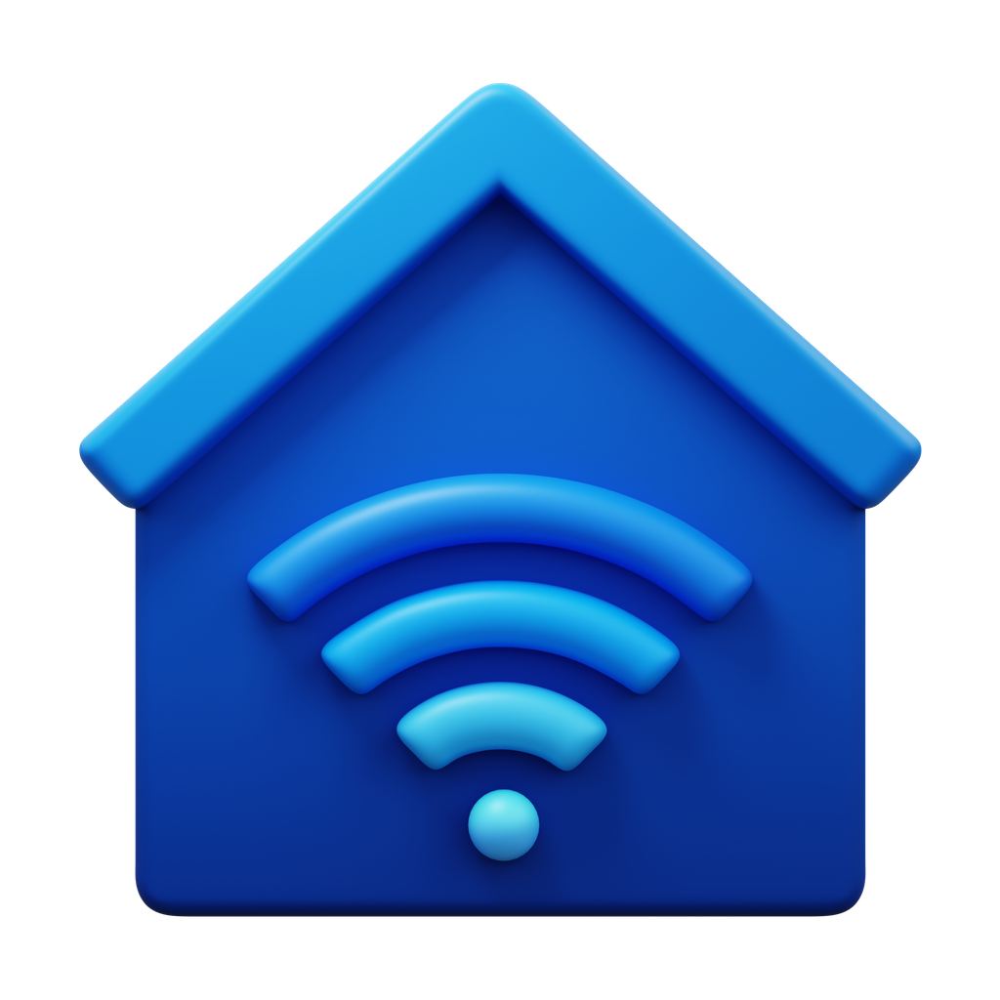
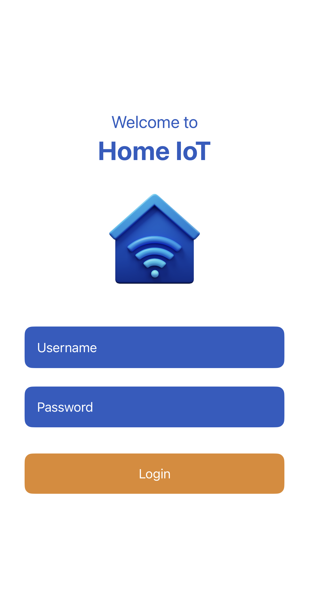
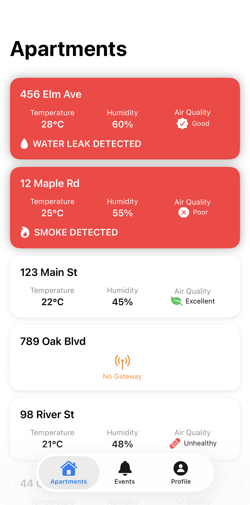
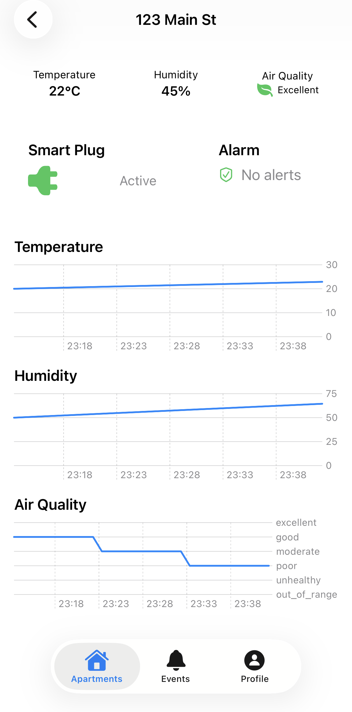
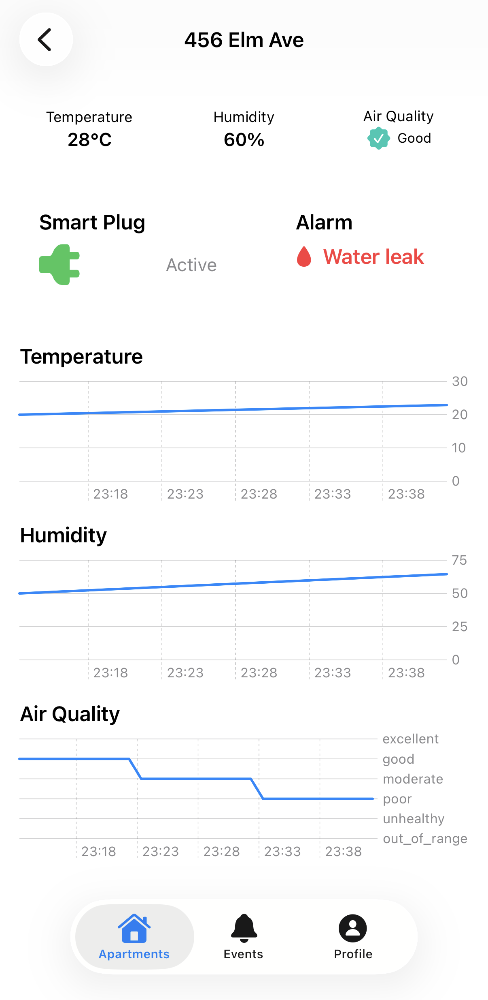
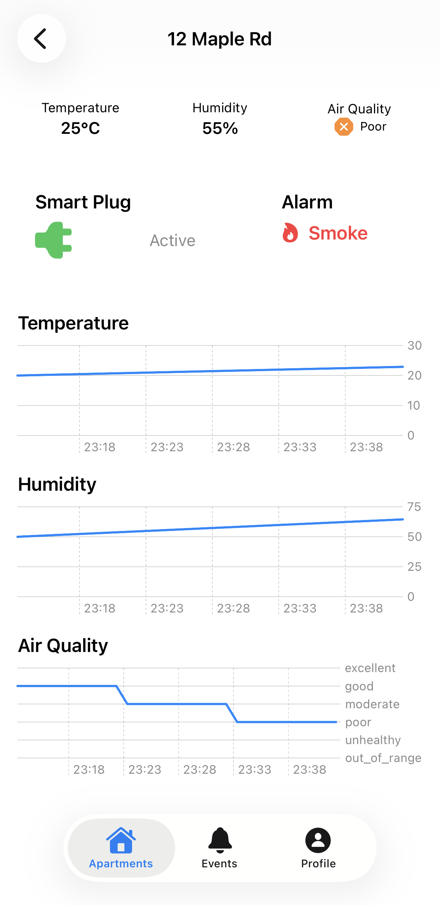
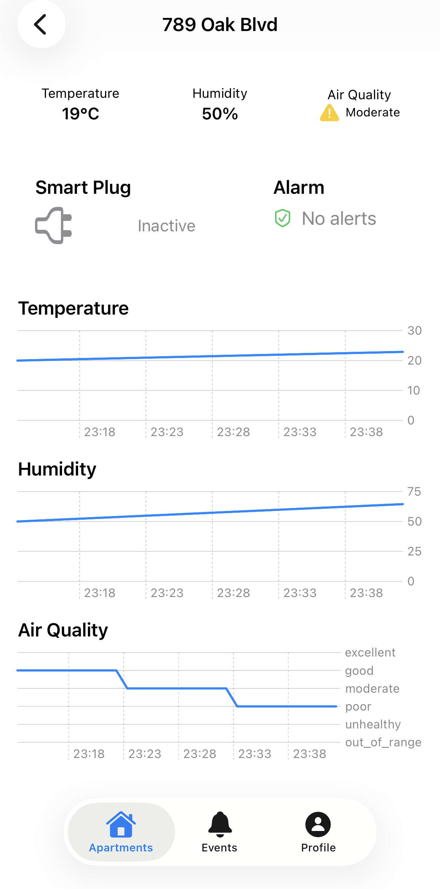
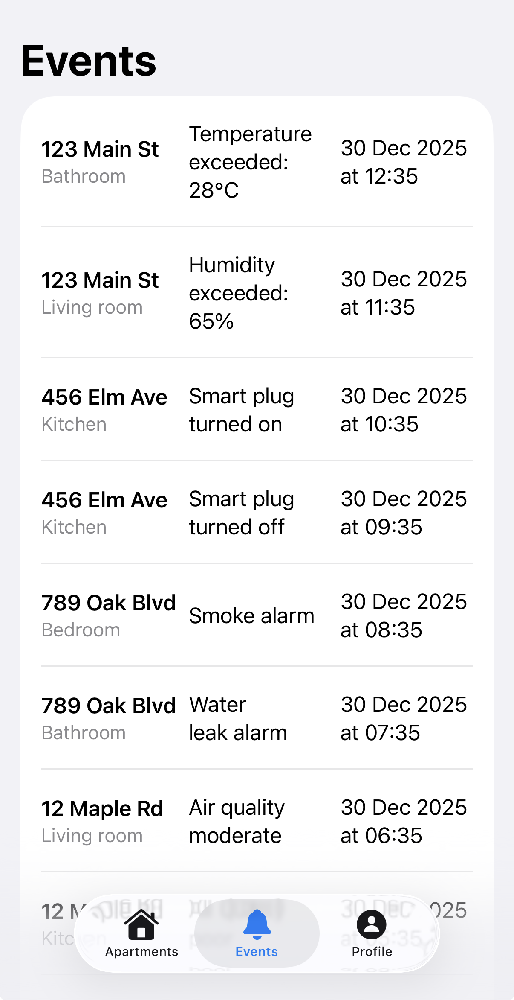
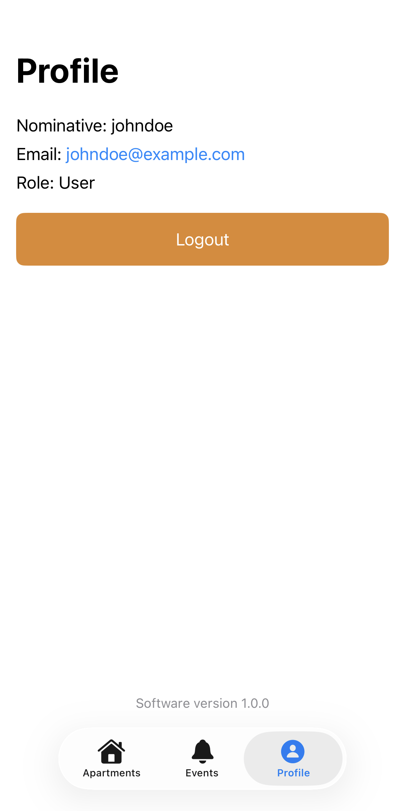

# Home IoT Platform



## Overview

**Home IoT** is a comprehensive, open-source Internet of Things (IoT) platform designed for intelligent home automation and telemetry management. It provides a modular microservices architecture that enables real-time collection, processing, and analysis of sensor data from Zigbee-enabled IoT devices. The platform supports seamless integration with smart home devices, asynchronous event processing, centralized user management, and a secure, scalable API layer.

Built on a modern cloud-native stack using Spring Boot and Spring Cloud, Home IoT is ideal for developers, system integrators, and IoT enthusiasts who want a flexible, production-ready solution to:

- Acquire telemetry data from Zigbee-based sensors in real-time
- Process and store events from distributed IoT devices
- Manage users and permissions with centralized authentication
- Query and retrieve the latest sensor readings with low latency
- Scale horizontally to support large deployments

---

## Technology Stack

The Home IoT platform is built using industry-leading open-source technologies:

| Component | Technology |
|-----------|-----------|
| **Language** | Java 21 |
| **Framework** | Spring Boot 4.0.1, Spring Cloud 2025.1.0 |
| **Build Tool** | Gradle (Kotlin DSL) |
| **API Gateway** | Spring Cloud Gateway (WebFlux/WebMVC) |
| **Message Broker** | RabbitMQ (asynchronous event streaming) |
| **IoT Protocol** | MQTT (Zigbee2MQTT integration) |
| **Security** | Spring Security |
| **Project Grouping** | Git Submodules for independent versioning |

---

## Architecture Overview

Home IoT follows a **microservices architecture** pattern with clear separation of concerns:

```
┌─────────────────────────────────────────────────────────────┐
│                     Client Applications                     │
│              (Mobile, Web, IoT Devices)                     │
└────────────────────────┬────────────────────────────────────┘
                         │
         ┌───────────────▼───────────────┐
         │   API Gateway (Spring Cloud)  │
         │   - Request Routing           │
         │   - Authentication            │
         │   - Rate Limiting             │
         └───────────────┬───────────────┘
                         │
        ┌────────────────┼────────────────┐
        │                │                │
    ┌───▼────┐   ┌──────▼──────┐   ┌─────▼────┐
    │ Auth   │   │  Domain     │   │Telemetry │
    │Service │   │ Microsvcs   │   │ Microsvcs│
    └────────┘   └─────────────┘   └──────────┘
        │                │                │
        └────────────────┼────────────────┘
                         │
        ┌────────────────▼────────────────┐
        │  Message Broker (RabbitMQ)      │
        │  - Asynchronous Event Streaming │
        │  - Service-to-Service Comm.     │
        └────────────────┬────────────────┘
                         │
        ┌────────────────▼────────────────┐
        │ Service Registry (Eureka)       │
        │ - Service Discovery             │
        │ - Health Monitoring             │
        └─────────────────────────────────┘
```

---

## UI - iOS

Below is an overview of the main screens in the Home IoT iOS application.

---

### 1. Login Page


---

### 2. Apartments List


---

### 3. Apartment Detail


---

### 4. Water Leak Alarm


---

### 5. Smoke Alarm


---

### 6. No Alarm


---

### 7. Events


---

### 8. Profile



## Microservices Architecture

### 1. **API Gateway & Entry Point**

#### `home-iot-api-gateway`
- **Purpose:** Central API Gateway - the single entry point for all external client requests
- **Responsibilities:**
  - Route incoming API requests to appropriate microservices based on request path
  - Handle cross-cutting concerns: authentication, authorization, rate limiting
  - Support both synchronous (REST) and asynchronous (RabbitMQ-based) communication patterns
  - Aggregate responses from multiple services for complex queries
  - WebFlux for non-blocking, reactive request handling
- **Technology:** Spring Cloud Gateway, WebFlux/WebMVC, Eureka Client
- **Communication Patterns:**
  - **REST:** Direct synchronous calls to domain microservices
  - **Async:** Publishes telemetry queries to RabbitMQ for event-driven processing
- **Security:** Authenticates all incoming requests before routing

### 2. **Authentication & Security**

#### `home-iot-auth-server`
- **Purpose:** Centralized authentication and authorization service
- **Responsibilities:**
  - Issues and validates authentication tokens (JWT or session-based)
  - Manages user credentials securely
  - Enforces role-based access control (RBAC)
  - Integrates with all microservices for authorization checks
  - Manages password policies and security configurations
- **Technology:** Spring Boot, Spring Security, Eureka Client
- **Service Registration:** Registers with Eureka for discoverability
- **Notes:** Critical component for platform security and multi-tenant support

### 3. **Domain Microservices**

#### `home-iot-ms-apartment`
- **Purpose:** Manages apartment/property-level entities and telemetry aggregation
- **Responsibilities:**
  - CRUD operations for apartment/property entities
  - Aggregates telemetry data from devices within an apartment
  - Retrieves latest sensor readings for devices
  - Publishes apartment-related events asynchronously via RabbitMQ
  - Handles queries for apartment status and device mappings
- **Technology:** Spring Boot, Spring Security, RabbitMQ Client, Eureka Client
- **Data Model:** Apartments, rooms, device mappings, aggregated telemetry
- **Event Publishing:** Emits events when apartments or device states change

#### `home-iot-ms-user`
- **Purpose:** User account and profile management service
- **Responsibilities:**
  - User registration and account creation
  - User profile management (name, email, preferences)
  - User role and permission assignments
  - Integration with auth server for credential management
  - User data persistence and retrieval
- **Technology:** Spring Boot, Spring Security, JPA/Hibernate, Eureka Client
- **Service Registration:** Registers with Eureka for service discovery
- **Security:** Spring Security integration for role-based access

#### `home-iot-ms-events`
- **Purpose:** Event management and event sourcing service
- **Responsibilities:**
  - Consumes events from RabbitMQ published by other microservices
  - Stores events for audit trails and historical analysis
  - Provides event query and filtering APIs
  - Event deduplication and processing
  - Real-time event notification to subscribed clients
- **Technology:** Spring Boot, Spring Cloud Stream, RabbitMQ
- **Deployment:** Independent deployment as a Git submodule
- **Event Sources:** Receives events from telemetry services, apartment service, user service
- **Scalability:** Handles high-volume event streams with asynchronous processing

#### `home-iot-ms-gateway`
- **Purpose:** Additional gateway service for telemetry and sensor data routing
- **Responsibilities:**
  - Provides supplementary APIs for telemetry queries
  - Acts as a facade for complex multi-service queries
  - Publishes telemetry-related events to RabbitMQ
  - Handles device discovery and metadata queries
  - May serve as a secondary gateway for specific device types
- **Technology:** Spring Boot, RabbitMQ Client, Eureka Client
- **Deployment:** Independent module (Git submodule reference)

### 4. **Telemetry Microservices**

#### `home-iot-ms-telemetry-reader`
- **Purpose:** Real-time telemetry data ingestion and query service
- **Responsibilities:**
  - Read telemetry data from sensors (via MQTT, REST APIs, or message queues)
  - Validate and normalize sensor data formats
  - Store telemetry readings with timestamps
  - Provide REST APIs to query historical telemetry data
  - Support range queries, aggregations, and filtering
  - Publish telemetry events asynchronously to RabbitMQ for downstream processing
  - Expose APIs for retrieving latest sensor values
- **Technology:** Spring Boot, Spring Data, Time-series data support, RabbitMQ Client
- **Data Model:** Time-series sensor readings with metadata
- **Performance:** Optimized for high-volume read operations and time-range queries
- **Event Publishing:** Continuously emits sensor reading events

#### `home-iot-ms-telemetry-writer`
- **Purpose:** Telemetry data persistence and write optimization
- **Responsibilities:**
  - Accept telemetry data from external IoT devices or forwarders
  - Write telemetry data to persistent storage (database)
  - Handle data validation, transformation, and enrichment
  - Publish write confirmation events to RabbitMQ
  - Implement data buffering and batch operations for efficiency
  - Manage data retention policies
- **Technology:** Spring Boot, Spring Data, Database drivers, RabbitMQ Client
- **Deployment:** Independent microservice (Git submodule)
- **Data Persistence:** Direct database writes for durability
- **Event Publishing:** Emits events for write completions and errors

### 5. **IoT Device Integration**

#### `home-iot-zigbee2mqtt-forwarder`
- **Purpose:** Bridge between Zigbee devices and the Home IoT platform via MQTT
- **Responsibilities:**
  - Subscribe to Zigbee2MQTT MQTT broker topics
  - Receive real-time telemetry from Zigbee sensors and devices
  - Format and transform Zigbee device data to platform format
  - Forward telemetry data to the telemetry microservices
  - Handle device discovery announcements from Zigbee network
  - Manage device lifecycle events (join, leave, status updates)
- **Technology:** Python, MQTT Client, REST APIs
- **Deployment:** Standalone Python application (containerized via Docker)
- **Communication Protocol:** 
  - MQTT for Zigbee device communication
  - REST/HTTP to publish data to telemetry services
- **File:** `zigbee2mqtt_forwarder.py`
- **Docker:** Includes `Dockerfile` for containerization
- **Configuration:** Environment variables in `.env` file

---

## Communication Patterns

### Synchronous Communication
- **REST APIs:** Direct HTTP calls between services via API Gateway
- **Service-to-Service:** Using Eureka for service discovery
- **Use Cases:** User queries, device status checks, configuration retrieval

### Asynchronous Communication
- **RabbitMQ:** Event-driven messaging for decoupled services
- **Publish-Subscribe:** Services publish events, others subscribe and process
- **Use Cases:** Telemetry events, device alerts, audit logging, data aggregation

### Service Discovery
- **Eureka Client:** All services register their health and location
- **Load Balancing:** Spring Cloud provides client-side load balancing
- **Resilience:** Services can handle temporary unavailability of other services

---

## Data Flow Example: Telemetry Ingestion

```
1. Zigbee Device → Zigbee2MQTT Network
                      ↓
2. MQTT Forwarder → Consumes MQTT messages
                      ↓
3. Telemetry Writer → Receives and persists data
                      ↓
4. RabbitMQ → Publishes telemetry events
                      ↓
5. Event Service → Consumes and stores events
   Apartment Service → Aggregates data
                      ↓
6. API Gateway ← Query requests
                      ↓
7. Client Application ← Telemetry data
```

---

## Project Structure

```
home-iot/
├── README.md                                 # This file
├── home-iot-api-gateway/                    # API Gateway (Spring Cloud Gateway)
│   └── src/main/java/...
├── home-iot-auth-server/                    # Authentication & Authorization
│   ├── src/main/java/...
│   └── src/test/java/...
├── home-iot-ms-apartment/                   # Apartment Domain Service
│   ├── src/main/java/...
│   └── src/test/java/...
├── home-iot-ms-user/                        # User Management Service
│   ├── src/main/java/...
│   └── src/test/java/...
├── home-iot-ms-events/                      # Event Management Service (Submodule)
│   └── src/main/java/...
├── home-iot-ms-gateway/                     # Telemetry Gateway Service (Submodule)
│   └── src/main/java/...
├── home-iot-ms-telemetry-reader/            # Telemetry Reader Service (Submodule)
│   └── src/main/java/...
├── home-iot-ms-telemetry-writer/            # Telemetry Writer Service (Submodule)
│   └── src/main/java/...
├── home-iot-zigbee2mqtt-forwarder/          # Zigbee2MQTT Forwarder (Python)
│   ├── zigbee2mqtt_forwarder.py             # Main forwarder application
│   ├── Dockerfile                           # Docker container configuration
│   └── env                                  # Environment variables
└── images/                                  # Documentation images
    ├── smart-home.png
    ├── apartments-list.png
    ├── apartment-details.png
    └── ... (UI screenshots)
```

---

## Getting Started

### Prerequisites

- **Java 21** or higher
- **Gradle** (included via gradle wrapper)
- **Docker & Docker Compose** (for local development)
- **Git** (for cloning and submodule management)

### Building the Project

# Change to ONE service
docker compose up -d --build <service-name>

# Change to home-iot-common (rebuild everything)
docker compose up -d --build

# Only environment variables changed in docker-compose
docker compose up -d <service-name>

# View logs in real time
docker compose logs -f <service-name>

# Fast development: only infrastructure in Docker
docker compose up -d mongodb rabbitmq influxdb mosquitto
# → then run the service from the IDE with the "docker" profile


## Acknowledgments

Built with ❤️ using Spring Boot, Spring Cloud, and the IoT community.
